# Interactive Investor Dashboard

Our goal was to build an interactive dashboard allowing users to pull stock and crypto currency financial information and provide them with a number of helpful resources to make investing decisions.  We delivered with a streamlit built user interface that pulls from a list of around 3,000 stocks and 30 crypto currencies and gives the user a quick overview of some of the more important financial indicators for that security. 

The application is easy to use and efficent.  Users are promted to select either a crypto or stock on the naviation bar located on the left.  The user also has a place to select the time frame of the dataset.  Once selected the applications main section outputs a number of important data charts and graphs that help users understand the current forecast of that security.  The data is pulled directly from Yahoo Finance with more information being available for stocks than crypto currencies.  

# Crypto Currencies

The initial datasets outlined for crypto currencies include some of the basic information for the latest day of trading.  The Technical Indicators section ins applicable to both the stocks and crypto landing page and includes a Bollinger Bands, Moving Average Convergence Divergence, Relative Strength Index, True Strength Index and Rate of Change.  Each graph includes a button that will direct the user to helpful information on how to read each graph and their signifigance to the overall securitys financial picture. The final data set that is included in the crypto landing page is a prior 10 day snapshot.

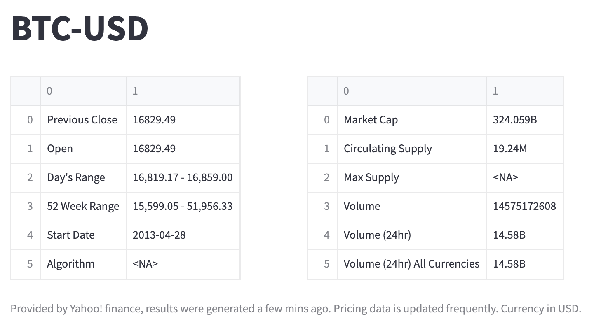

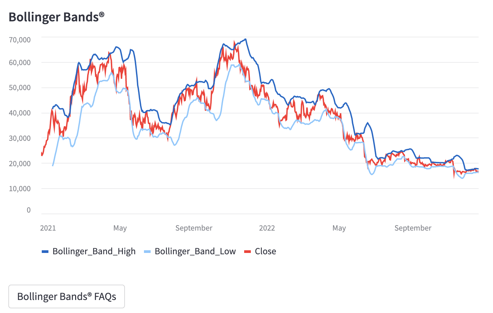

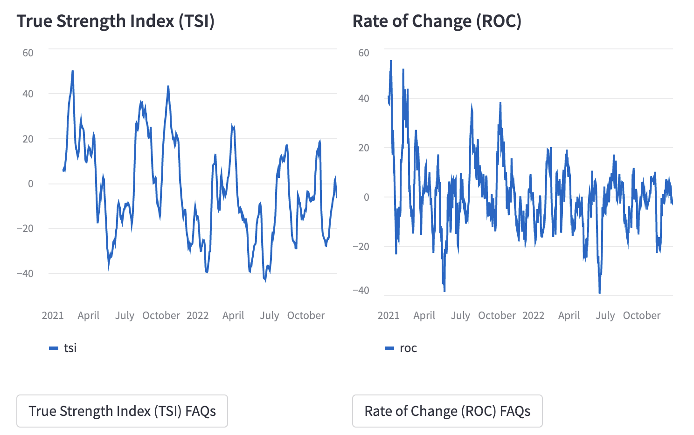

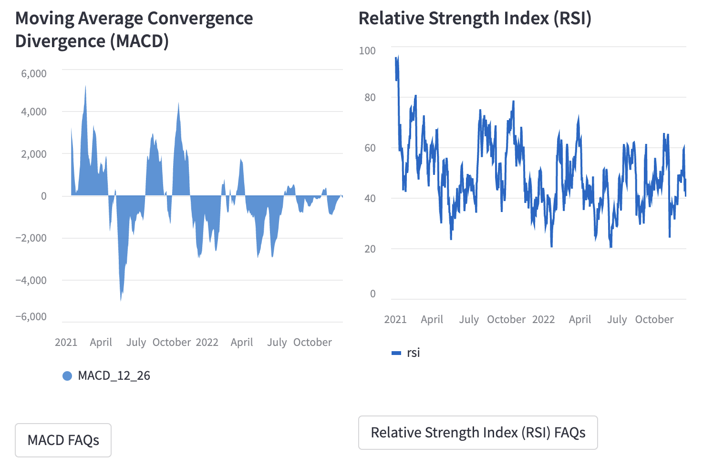

# Stocks

The stocks landing page includes all of the information as above but also includes a section of buy & sell recomendations from multiple sources below the prior days closing information.  After the graphs and 10 day snapshot you can find the Additional Corporate Data section which shows a list of the largest institutional holders of the stock, a section on the breakdown of major shareholders, the most recent financials, balance sheet and cashflow. 

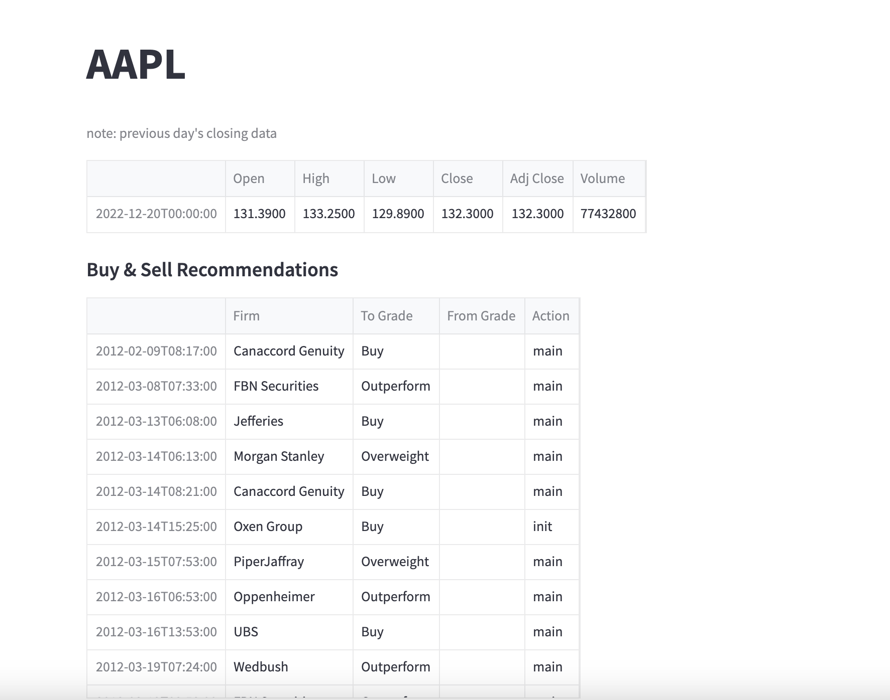

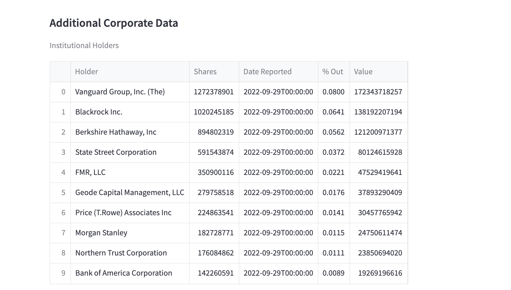

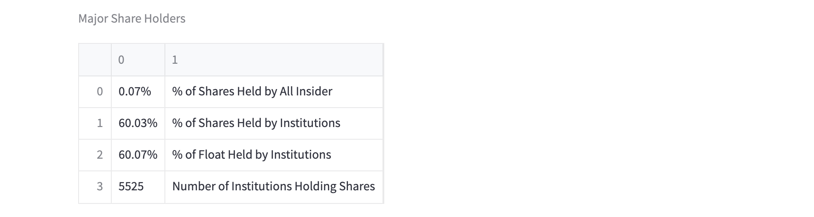

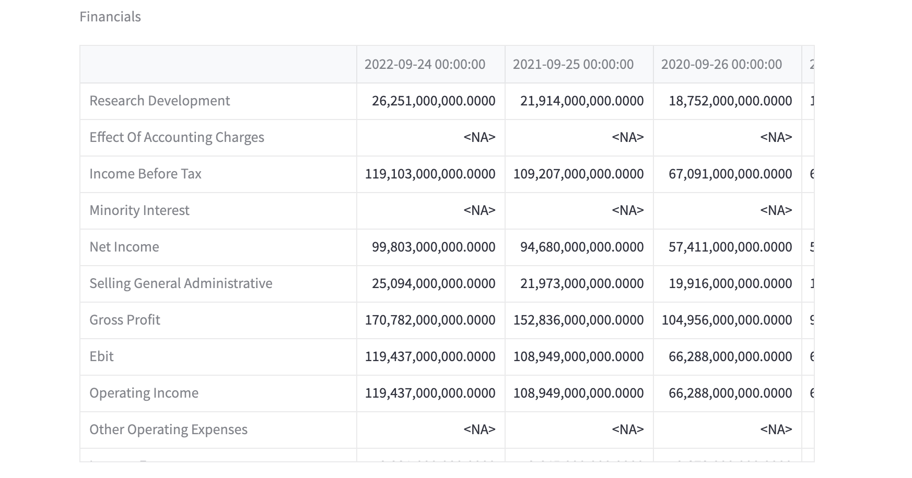

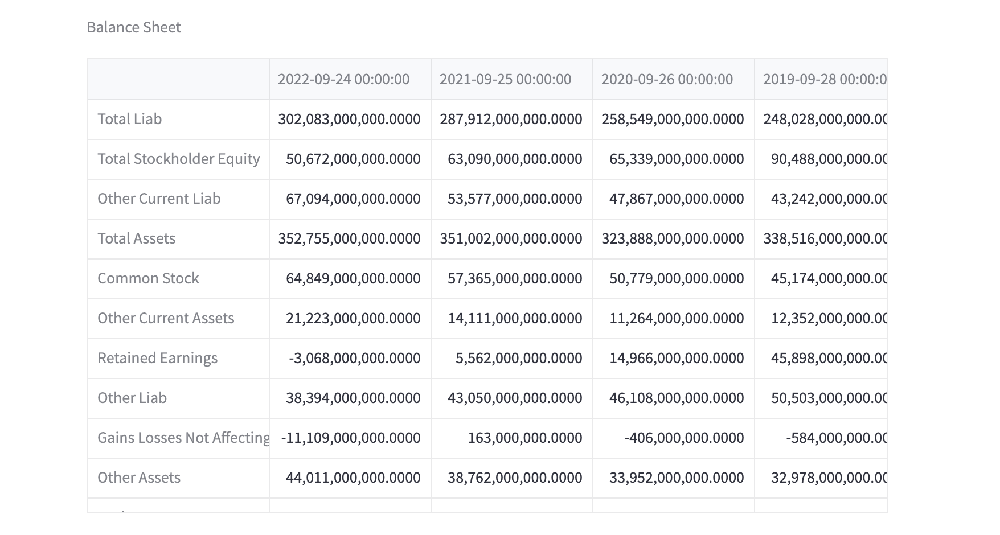

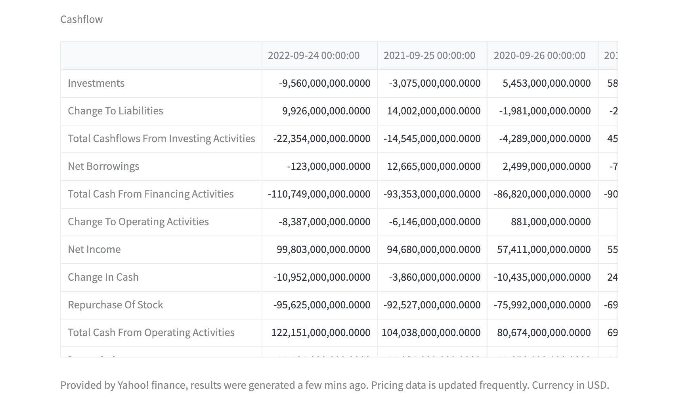

# Printing to Excel/CSV

For either landing page the user will have an opportunity to download either an excel spreadsheet or csv dataset by clicking either the link or button indicated.  The download will print all the relevant information presented on the landing page. 

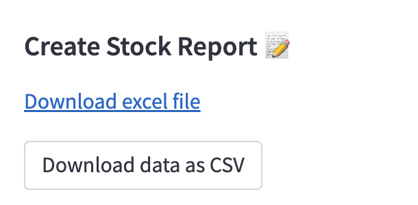
