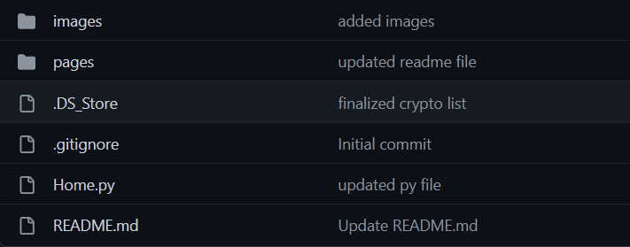

# Interactive Investor Dashboard

Our goal was to build an interactive dashboard allowing users to pull stock and crypto currency financial information and provide them with a number of helpful resources to make investing decisions.  We delivered with a streamlit built user interface that pulls from a list of around 3,000 stocks and over 100 crypto currencies and gives the user a quick overview of some of the more important financial indicators for that security. 

The application is easy to use and efficent.  Users are promted to select either a crypto or stock on the naviation bar located on the left.  The user also has a place to select the time frame of the dataset.  Once selected the applications main section outputs a number of important data charts and graphs that help users understand the current forecast of that security.  The data is pulled directly from Yahoo Finance with more information being available for stocks than crypto currencies.  

# Installation Instructions

To run the app ensure that all files and folders are copied to a specified local folder on your computer. This is a multipage streamlit app that uses the home.py file to run the app. The home.py file should be at the root of the folder with the image and pages folder as subfolders. To run the app using a terminal console navigate to the folder where the home.py file is located and type streamlit run home.py this will launch a browser session with the Investor Dashboard app. See below for an example of the folder structure.

# Crypto Currencies

The initial datasets outlined for crypto currencies include some of the basic information for the latest day of trading.  The Technical Indicators section is applicable to the stocks, crypto, currency and commodities landing pages and includes a Bollinger Bands, Moving Average Convergence Divergence, Relative Strength Index, True Strength Index and Rate of Change.  Each graph includes a button that will direct the user to helpful information on how to read each graph and their signifigance to the overall securitys financial picture. The final data set that is included in the crypto landing page is a prior 10 day snapshot.

#### Key Bollinger Bands® Takeaway's
Bollinger Bands® consist of a centerline and two price channels or bands above and below it. The centerline is typically a simple moving average while the price channels are standard deviations of the stock being studied. The bands expand and contract as price action becomes volatile (expansion) or bound into a tight trading pattern (contraction). Traders designate the upper and lower bands as price targets when drawing the bands. When the price continually touches the upper Bollinger Band, it can indicate an overbought signal while continually touching the lower band indicates an oversold signal.

#### Key MACD Takeaway's
The moving average convergence/divergence (MACD, or MAC-D) line is calculated by subtracting the 26-period exponential moving average (EMA) from the 12-period EMA. The signal line is a nine-period EMA of the MACD line. MACD is best used with daily periods, where the traditional settings of 26/12/9 days is the norm. MACD triggers technical signals when the MACD line crosses above the signal line (to buy) or falls below it (to sell). MACD can help gauge whether a security is overbought or oversold, alerting traders to the strength of a directional move, and warning of a potential price reversal. MACD can also alert investors to bullish/bearish divergences (e.g., when a new high in price is not confirmed by a new high in MACD, and vice versa), suggesting a potential failure and reversal. After a signal line crossover, it is recommended to wait for three or four days to confirm that it is not a false move.

#### Key RSI Takeaway's
The relative strength index (RSI) is a popular momentum oscillator introduced in 1978. The RSI provides technical traders with signals about bullish and bearish price momentum, and it is often plotted beneath the graph of an asset’s price. An asset is usually considered overbought when the RSI is above 70 and oversold when it is below 30. The RSI line crossing below the overbought line or above oversold line is often seen by traders as a signal to buy or sell. The RSI works best in trading ranges rather than trending markets.

#### Key TSI Takeaway's
The TSI fluctuates between positive and negative territory. Positive territory means the bulls are more in control of the asset. Negative territory means the bears are more in control. When the indicator divergences with price, the TSI may be signaling the price trend is weakening and may reverse. A signal line can be applied to the TSI indicator. When the TSI crosses above the signal line it can be used as a buy signal, and when it crosses below, a sell signal. Such crossovers occur frequently, so use with caution. Overbought and oversold levels will vary by the asset being traded.

#### Key ROC Takeaway's
Rate of change (ROC) refers to how quickly something changes over time. It is thus the acceleration or deceleration of changes (i.e., the rate) and not the magnitude of individual changes themselves. In finance, rate of change is used to understand price returns and identify momentum in trends. Moving averages are used by traders to understand the rates of change in asset prices by smoothing them out. The Price Rate of Change indicator is a technical tool that measures the percentage change in price between the current price and the price a certain number of periods ago.

# Currency and Commodities

The Currency and Commodities landing pages includes all of the information as above including the Technical Indicators for Bollinger Bands, Moving Average Convergence Divergence, Relative Strength Index, True Strength Index and Rate of Change.

# Stocks

The stocks landing page includes all of the information as above but also includes a section of buy & sell recomendations from multiple sources below the prior days closing information.  After the graphs and 10 day snapshot you can find the Additional Corporate Data section which shows a list of the largest institutional holders of the stock, a section on the breakdown of major shareholders, the most recent financials, balance sheet and cashflow. 

# Printing to Excel/CSV

For either landing page the user will have an opportunity to download either an excel spreadsheet or csv dataset by clicking either the link or button indicated.  The download will print all the relevant information presented on the landing page. 

# Future Enhancements

Going forward we would like to add some additional future enhancements that include generation of PDF reports along with integration of our personal investment portfolios into the dashboard to allow for us to perform trades and research from a single app.
